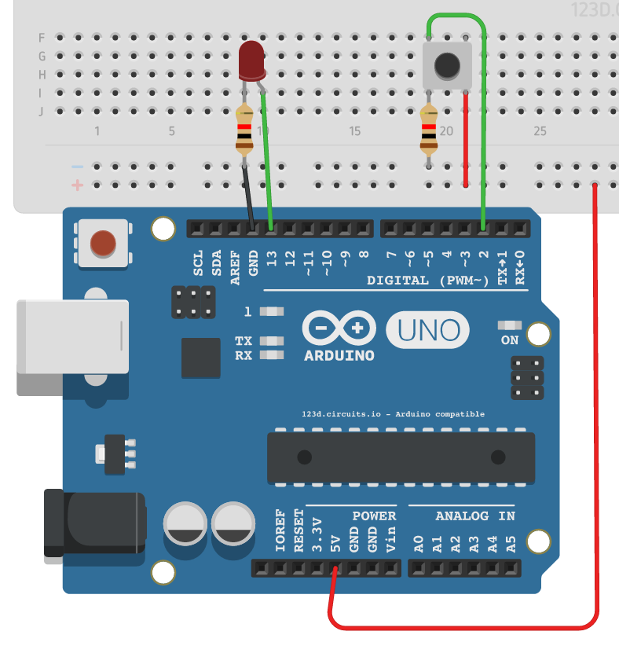
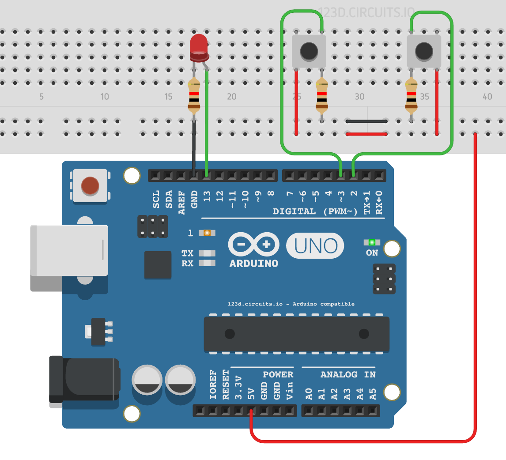

# Introduction
This assignment consisted of the implementation of an [event driven library for Arduino](event_driven.h) that takes control of the program execution flow (by implementing `loop`) and that listens to and notifies the client user application of events. The library was then used to reimplement the `Hello World` example as well as `assignment #2`.

# Library Design
The library is designed in a synchronous non-blocking fashion by using observers and invertion of control. In regards to the former, the user must implement observer functions that are called when the state of a resource of interest changes. As for the latter, no loops are explicitly done by the library, state variables are used instead and updated when Arduino's native `loop` function is executed. This way, the library makes sure that it doesn't block and any events the client is listening to are handled as fast as possible. Given the simplicity of the library design, if events are being missed or something is taking too long, the culprit is most certainly a user-provided callback.

In its current state the library is very simple and limited. It only handles two events: 
* `button_changed`: for changes in the state of a button
* `timer_expired` : for the expiration of a single one-shot timer

The user is required to implement *all* the associated callbacks that handle these events, even if only a subset of them is required in the user app. This is due to the simplicity of the library's design, which requires that the callback for a given event should have its name, as defined above. Given that not providing an implementation results in a compilation error, the library provides two pre-processor definitions that are evaluated to empty-bodied functions and allow the user to effectively ignore a set of events:
* `TIMER_OFF` : ignore `timer_expired` events
* `BUTTON_OFF`: ignore `button_changed` events
Place these symbols, if necessary, right after the inclusion of the header.

Finally, the user is also required to implement a `init` function, which is called during the setup of the environment. Due to `multiple definitions` errors occurred when trying to declare the user-controlled initialization function with the name `init`. Hence, it's name was changed to `user_init`.

# Simulation
Simulations were done on [123D Circuits](https://123d.circuits.io), albeit with slight modifications to the code. As the runtime only allows for a single source code file, the library and user app were put together. They are visually separated by comments that defined their start and end. Also, as can be learned by reading `event_driven.c`, the library keeps its variables private, which is not possible on the simulator. Regardless, it's possible to test on the simulation that the code works as expected.

## Event-Driven Hello World
The [event-driven `Hello World` example](hello_world_event/hello_world_event.ino) can be tested here: https://123d.circuits.io/circuits/1807187-tarefa-03-event-driven-hello-world

## Event-Driven Assignment 2
The [event-driven `Assignment 2` code](tarefa_2_event/tarefa_2_event.ino) can be tested here: https://123d.circuits.io/circuits/1809305-tarefa-03-tarefa-02-event-driven

## Run using the Arduino IDE
The only necessary step you must take before loading the program onto an Arduino is to copy `event_driven.h` and `event_driven.c` to the folder of the sub-assignment.
